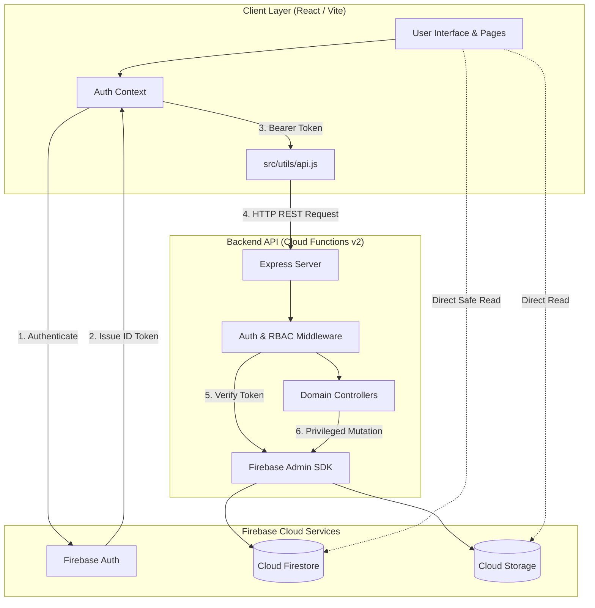

# System Authority Model & Security Architecture

**Project**: React-Collage-B  
**Version**: 2.0.0  
**Authoritative Source**: Antigravity Full-Stack Architecture Guidelines  

---

## 1. Core Principle: Single Source of Truth

To prevent privilege escalation, data race conditions, and bypass of business logic, every operational domain in React-Collage-B is assigned a single authoritative controller:

| Operational Domain | Authoritative Controller | Enforcement Layer | Client Capability |
| :--- | :--- | :--- | :--- |
| **User Identity & Credentials** | **Firebase Authentication** | RSA-256 Signed ID Tokens | Initiates OAuth / Credential Login |
| **User Role & Status** | **Firestore `users/{uid}` via Admin SDK** | `authenticate` & `requireAdmin` middleware | Read-only in token / profile payload |
| **Admin Operations** | **Express API (Functions v2)** | Server-side `requireAdmin` validation | Requests via HTTP Bearer token |
| **Collage & Project State** | **Express API & Firestore Transactions** | Server-side validation & ownership checks | Requests CRUD operations |
| **Collage Comments & Reactions** | **Express API with Atomic Counters** | Server-side batch operations | Submits comment / reaction requests |
| **Public Catalog Reads** | **Firestore Client SDK** | `firestore.rules` (read: if true) | Direct query with local caching |
| **Image Storage & Media** | **Firebase Storage + Firestore Metadata** | `storage.rules` (type, size, owner checks) | Uploads authorized assets |

---

## 2. Component Authority Boundaries

---

## 3. Direct Client Mutation Safeguards

Direct client writes from frontend JavaScript (`addDoc`, `updateDoc`, `deleteDoc`) are strictly constrained:
1. **Never Allow Direct Privilege Escalation**:
   The `role`, `banned`, and `violations` fields in `users` collection cannot be updated directly from the browser; only the backend Admin SDK can write to these fields.
2. **Atomic Ingestion**:
   When products, collages, or users are created, all required fields (including timestamps, initial counters, and default statuses) are validated atomically.
3. **Owner-Scoped Mutations**:
   A user can only update their own profile and content where `request.auth.uid == userId` or `resource.data.ownerId == request.auth.uid`.
