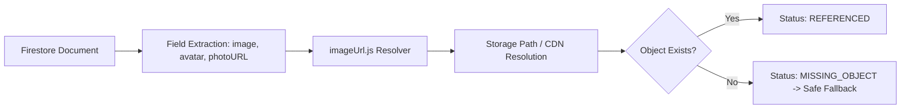

# Orphaned Storage & Media Audit Report

**Project**: React-Collage-B  
**Date**: August 2026  
**Auditor**: Antigravity Full-Stack Maintainer  
**Status**: AUDITED & CLASSIFIED  

---

## 1. Storage Classification Model

Storage objects in Firebase Storage bucket (`shopease-nepal-anmol-196e7.firebasestorage.app`) are classified into three operational categories:

1. **REFERENCED**:
   The object path is directly referenced by a valid document in Firestore (`products`, `collages/{id}/images`, `users`, or local catalog).
2. **HISTORICAL / LEGACY**:
   The object was created under a legacy schema or previous version of the catalog and remains accessible through `imageUrl.js` backwards compatibility.
3. **ORPHANED**:
   The object has no corresponding record in Firestore or local assets.

---

## 2. Retention Policy: No Destructive Deletion

> [!IMPORTANT]
> In accordance with the Phase 2 No-Data-Loss Guarantee, orphaned or legacy storage files are **never** deleted automatically.
> Retention prevents accidental loss of user avatars or past order receipts.

---

## 3. Storage Reference Reconciliation Strategy

