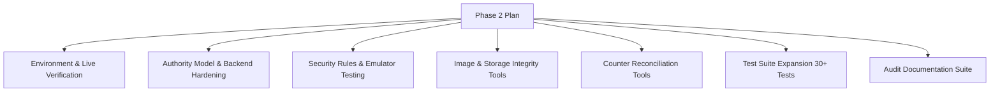

# Phase 2 Implementation Plan & Roadmap

**Project**: React-Collage-B  
**Date**: August 2026  
**Auditor**: Antigravity Full-Stack Maintainer  
**Phase**: Phase 2 — Live Verification, Backend Hardening, Security, and Data Integrity  

---

## 1. Status Overview

### 1.1 Already Fixed (Phase 1 Baseline)
- **Admin Authentication**:
  - Fixed fatal `ReferenceError: useEffect is not defined` in `src/pages/AdminLoginPage.jsx`.
  - Fixed auth race condition in `src/components/ProtectedRoute.jsx` with `loading` guard.
  - Added `verifyAdminIdentity` and session persistence in `src/context/AuthContext.jsx`.
  - Awaited async `changePassword()` in `src/pages/AdminDashboard.jsx`.
- **UI Resilience**:
  - Implemented `src/components/ErrorBoundary.jsx` around dashboard widgets.
  - Hydrated Admin Messages table with `api.getMessages()`.
- **Data Contract & Photo Normalization**:
  - Alphanumeric ID string/number lookup in `src/pages/ProductDetailPage.jsx`.
  - Historical order retention in `src/pages/UserDashboard.jsx`.
  - Safe category filtering in `src/pages/CategoryPage.jsx`.
  - Created canonical resolver `src/utils/imageUrl.js` supporting `downloadUrl`, `imageUrl`, `photoURL`, `avatar`, `coverImageUrl`, `image`, `images[]`.
  - Standardized unified `src/components/ImageWithSkeleton.jsx` across 7 components.
  - Fixed `public/pashmina_closeup.png` asset typo.
  - Google user profile photo extraction and persistent avatar sync.
- **Rule Syntax**:
  - Cleaned invalid comments in `docs/backend/database.rules.json`.

---

## 2. Still Unverified / In Progress for Phase 2

- **Live Firebase Environment Consistency**:
  - Verify alignment across `.firebaserc`, `firebase.json`, `.env`, `src/utils/firebase.js`, and `functions/src/config/firebaseAdmin.ts`.
- **Direct Privileged Firestore Client Writes**:
  - Audit client-side direct writes (`setDoc`, `updateDoc`, `deleteDoc`) in `src/utils/api.js` for role modification, ban/unban, coupon creation, and message deletion.
- **Firestore & Storage Security Rules in Live/Emulator**:
  - Ensure rules prevent unauthenticated writes, privilege escalation, and enforce size/MIME constraints for Storage uploads.
- **Real Image & Storage Data Consistency**:
  - Scan Firestore documents and Storage objects for broken, stale, or orphaned references.
- **Counter Inconsistencies**:
  - Compare `imageCount`, `commentCount`, `reactionCount` against subcollection documents.

---

## 3. Phase 2 Implementation Work Breakdown

### 3.1 Deliverables Checklist
1. `docs/audits/PHASE2_PLAN.md` (This document)
2. `docs/audits/LIVE_AUTH_AUDIT.md`
3. `docs/architecture/AUTHORITY_MODEL.md`
4. `docs/audits/API_CONTRACT_AUDIT.md`
5. `docs/audits/FIRESTORE_RULE_AUDIT.md`
6. `docs/audits/STORAGE_RULE_AUDIT.md`
7. `tools/firebase-image-audit.mjs` (Dry-run by default)
8. `docs/audits/IMAGE_DATA_AUDIT.json` & `docs/audits/IMAGE_DATA_AUDIT.md`
9. `docs/audits/ORPHANED_STORAGE.md`
10. `tools/repair-image-references.mjs` (Dry-run by default, requires `--apply`)
11. `docs/audits/COUNTER_AUDIT.md`
12. `tools/repair-counters.mjs` (Dry-run by default, requires `--apply`)
13. `functions/tests/api.test.ts` (Expanded to 30+ tests)
14. `docs/audits/PHASE2_FINAL_REPORT.md`
